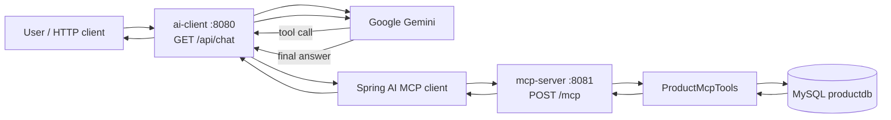

# Spring AI MCP POC

This repository is a two-app proof of concept:

- **`ai-client`** — a Spring Boot HTTP API that talks to Google Gemini and exposes product Q&A at `/api/chat`.
- **`mcp-server`** — a Spring Boot MCP server that owns the MySQL product database and publishes product lookup tools.

The client never queries the database directly. Gemini decides which tool to call; the MCP client in `ai-client` forwards that call to `mcp-server`; the server runs JPA against MySQL and returns the result. Gemini then writes the user-facing answer.

## Modules

```
Spring-AI-MCP-POC-TS/
├── ai-client/     Spring MVC + Google GenAI + MCP client
└── mcp-server/    Spring MVC + JPA/MySQL + MCP server tools
```

| App | Port | Role |
|---|---|---|
| `ai-client` | `8080` | Chat API, Gemini, MCP client handshake |
| `mcp-server` | `8081` | Streamable HTTP MCP endpoint at `/mcp`, product tools, database |

## Architecture



## Request flow

### 1. Startup (must start `mcp-server` first)

1. `mcp-server` starts on `8081`, connects to MySQL, and registers `@Tool` methods from `ProductMcpTools`.
2. Spring AI MCP server auto-configuration exposes Streamable HTTP at `/mcp` (`spring.ai.mcp.server.protocol=STREAMABLE`).
3. `ai-client` starts on `8080` and, during bean creation, the MCP client connects to `http://localhost:8081` and calls `initialize` on `/mcp`.
4. After handshake, the client lists tools (`getProduct`, `searchProducts`, `getProductsByCategory`, `getAllProducts`) and wraps them as a `ToolCallbackProvider`.
5. `ChatController` builds a `ChatClient` with those tools attached as default tools.

If `mcp-server` is not listening on `8081`, `ai-client` fails at startup with:

`Client failed to initialize by explicit API call`

### 2. Chat request

Example:

```http
GET http://localhost:8080/api/chat?message=Show%20all%20products
```

What happens:

1. `ChatController` sends the user message to Gemini through `ChatClient`, with the product-assistant system prompt and MCP tools available.
2. Gemini does **not** invent product data. It chooses a tool, typically `getAllProducts` for this prompt.
3. Spring AI `ToolCallingAdvisor` executes the selected tool via `SyncMcpToolCallbackProvider`.
4. The MCP client POSTs a JSON-RPC tool call to `http://localhost:8081/mcp`.
5. `ProductMcpTools.getAllProducts()` runs `productRepository.findAll()`.
6. The product list is returned over MCP to `ai-client`.
7. Gemini receives the tool result and produces the natural-language reply that `/api/chat` returns.

Other examples:

| User message | Typical tool |
|---|---|
| Show all products | `getAllProducts` |
| Find product 12 | `getProduct` with `id=12` |
| Search for laptop | `searchProducts` with `name=laptop` |
| Products in electronics | `getProductsByCategory` with `category=electronics` |

## How the two apps are wired

### `ai-client`

- `AiClientApplication` — Spring Boot entry point.
- `ChatController` (`/api/chat`) — HTTP entry point; builds `ChatClient` with MCP tools.
- `AiConfig` — additional `ChatClient` bean with the product-assistant system prompt and `.defaultTools(mcpTools)`.
- Google GenAI starter: `spring-ai-starter-model-google-genai`.
- MCP client starter: `spring-ai-starter-mcp-client`.

Client MCP connection (`ai-client/src/main/resources/application.properties`):

```properties
spring.ai.mcp.client.type=SYNC
spring.ai.mcp.client.streamable-http.connections.product-db.url=http://localhost:8081
```

The client default endpoint is `/mcp`, which matches the server default.

### `mcp-server`

- `McpServerApplication` — Spring Boot entry point.
- `ProductMcpTools` — MCP tools backed by `ProductRepository`.
- JPA entities: `Product`, `Category`, `Supplier`, `Inventory`.
- MCP server starter: `spring-ai-starter-mcp-server-webmvc`.

Server MCP settings (`mcp-server/src/main/resources/application.properties`):

```properties
spring.ai.mcp.server.name=product-db-mcp-server
spring.ai.mcp.server.version=1.0.0
spring.ai.mcp.server.protocol=STREAMABLE
```

### Product tools

Defined in `mcp-server/src/main/java/com/ai/poc/ts/mcpserver/mcp/ProductMcpTools.java`:

| Tool | Description | Data access |
|---|---|---|
| `getProduct` | Get a product by ID | `findById(id)` |
| `searchProducts` | Search products by name | `findByNameContainingIgnoreCase(name)` |
| `getProductsByCategory` | Find products by category name | `findByCategoryNameIgnoreCase(category)` |
| `getAllProducts` | Get all products | `findAll()` |

## Database

`mcp-server` uses MySQL database `productdb`. Hibernate `ddl-auto=update` creates/updates tables from the JPA entities.

Suggested local env vars (do not commit secrets):

```bash
export GOOGLE_API_KEY=...
export DB_USERNAME=...
export DB_PASSWORD=...
```

`ai-client` reads `GOOGLE_API_KEY`. Point datasource username/password at those env vars rather than hardcoding them.

## Run order

From the repo root:

```bash
./gradlew :mcp-server:bootRun
```

Wait for `Started McpServerApplication`. Then:

```bash
./gradlew :ai-client:bootRun
```

Or run `McpServerApplication` then `AiClientApplication` from the IDE.

Try:

```bash
curl "http://localhost:8080/api/chat?message=Show%20all%20products"
```

## Stack

- Java 21
- Gradle multi-module (`settings.gradle` includes `ai-client` and `mcp-server`)
- Spring Boot 4.1.1
- Spring AI 2.0.1
- Google Gemini (`gemini-2.5-flash`)
- MCP Streamable HTTP
- Spring Data JPA + MySQL
